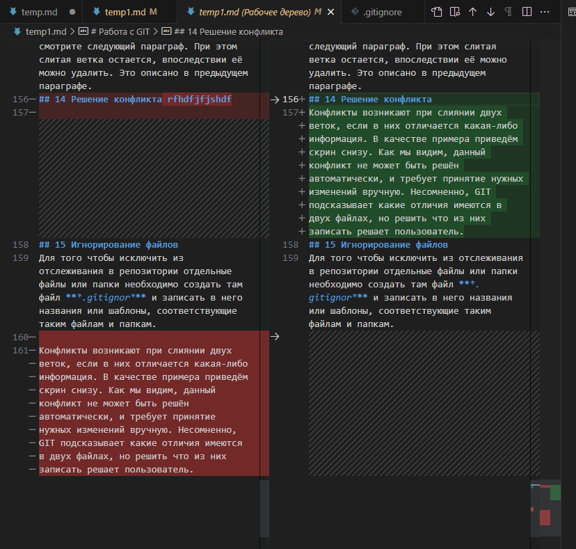
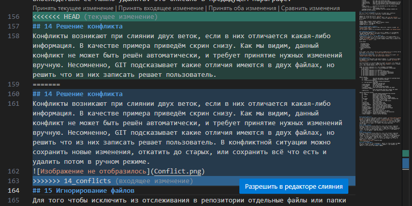
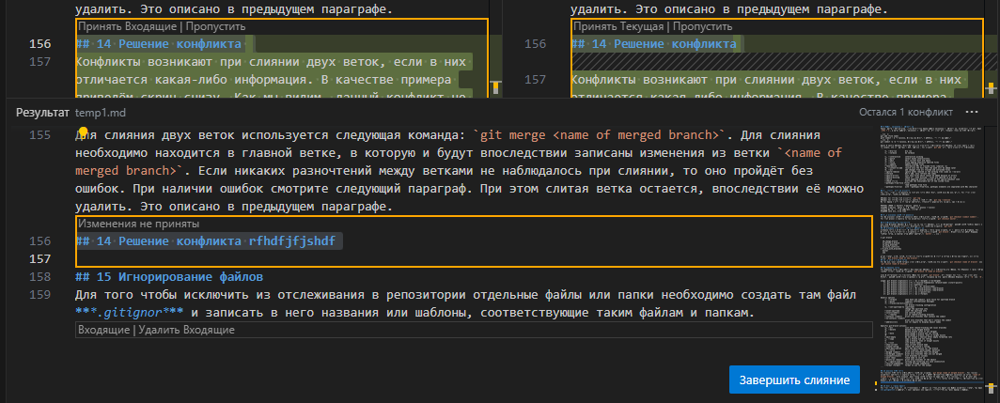

# Работа с GIT

## 1 проверка установлен ли GIT
В терминале нужно выполнить команду `git version`.
Если git установлен, пявится сообщение о версии программы.

```
Пример: git version 2.41.0.windows.1
```
## 2 Устанавливаем GIT 
Для установки программы необходимо перейти на сайт https://git-scm.com/ и скачать программу для определённой версии вашей операционной системы. Далее необходимо произвести установку. Все параметры выставлять по умолчанию (если понимаете хоть капельку, то можно бодстроить при установке под себя).
## 3 Насройка GIT
При первом запуске  представиться в git, иначе потом могут возникнуть проблемы с недопониманием от программы, кто пользователь.
Необходисо выполнить две команды:
```
git config --globaluser.name <your name>
git config --globaluser.email <your email>
```
## 4 Инициализация репозитория
После того, как настройка  была произведена успешно, можно приступать к работе с программой. Для этого, необходимо первым делом выбрать папку, в которой будет происходить контроль версий. Если в папке еще не был создан (инициализирован) контроль версии, то необходимо это выполнить. Для этого необходимо использовать команду `git init`. Это позволит создать репозиторий в папке.
## 5 Просмотр статуса программы
Для просмотра текщего статуса необходимо использовать команду `git status`. Она позволяет просматривать екущий статус файлов в отслеживаемом файле. Пример вывода после введения команды показан ниже:
```
$ git status
On branch 10_change_branch
Changes not staged for commit:
  (use "git add <file>..." to update what will be committed)
  (use "git restore <file>..." to discard changes in working directory)
        modified:   temp1.md

no changes added to commit (use "git add" and/or "git commit -a")
```
## 6 Запись изменений в репозиторий
Далее работа с GIT активна. После подготовки файла записи изменений в репозиторий, необходимо сохраить файл `CTRL + s`, а затем записать изменения в репозиторий. Это может быть сделанно одним из двух способов:
```
Пример 1: 
git add <file name>
gitt commit - m "сообщение, помогающее понять в будущем, что это за запись"
Пример 2:
git commit -a -m "сообщение, помогающее понять в будущем, что это за запись"
```
Также у каждой функции существует большое количество вспомогательных функций, их можно найти в самом терменале, где мы работаем с GIT. Например, для команды `git add` есть такое колличество дополнений:
```
    -n, --dry-run         dry run
    -v, --verbose         be verbose

    -i, --interactive     interactive picking
    -p, --patch           select hunks interactively
    -e, --edit            edit current diff and apply
    -f, --force           allow adding otherwise ignored files
    -u, --update          update tracked files
    --renormalize         renormalize EOL of tracked files (implies -u)
    -N, --intent-to-add   record only the fact that the path will be added later
    -A, --all             add changes from all tracked and untracked files
    --ignore-removal      ignore paths removed in the working tree (same as --no-all)
    --refresh             don't add, only refresh the index
    --ignore-errors       just skip files which cannot be added because of errors
    --ignore-missing      check if - even missing - files are ignored in dry run
    --sparse              allow updating entries outside of the sparse-checkout cone
    --chmod (+|-)x        override the executable bit of the listed files
    --pathspec-from-file <file>
                          read pathspec from file
    --pathspec-file-nul   with --pathspec-from-file, pathspec elements are separated with NUL character
```
## 7 Просмотор истории коммитов
Для того, чтобы в сохранённых версиях был смысл нужно уметь между ними переключаться. Для этого можно использовать следующие функции: 

Функция для вывода всех коммитов: `git log`.
Функция для вывода всех коммитов, каждый в одну строку: `git log --oneline`.
Версия файла в которой вы сейчас находитесь выделяется аналогичным образом, как в примере:
```
9467b4c (HEAD -> master) добавили раздел 3
121b50a добавили раздел 2, и проебали сохранение сообщения
c174ec2 первую строчку написали, молодцы мы
9fdd000 save all, 2-nd time
```
## 8 Перемещение между сохранениями
Для перемещения между сохранениями нужно использовать следующую команду: `git checkout <commit number>`. 
Для возвращения к главной версии необходимо ввести команду: `git checkout master`.

## 9 Дополнительные возможности
Ещё одна полезная функция при контроле версий это функция, которая показывает разницу между текущим файлом и последним сохранённым комиттом. Вызывается это следующей командой: `git diff`
## 10 Создание и просмотор веток в репозитории
Создание веток и их просмотр производится благодаря одной общей команде, но с разной интерпритацией. Для просмотра веток достаточно в командной строке ввести команду `git branch`. Звездочкой (*) будет указана текущая ветка, а главная етка будет называться `master`. Пример:
```
$ git branch

  10_change_branch
  11_delete_a_branch
  12_merg_branches
  13_solve_conflicts
* 9_work_with_branches
  master
  new
```
Чтобы создать новую ветку, достаточно ввести команду для просмотра ветвей и после неё добавить имя новой ветки: `git branch <name of new branch>`.
## 11 Переход к другой ветке
Для переключения между ветками можно использовать следующие две команды: `git checkout <name of branch>` или `git switch <name of branch>`. 

## 12 Удаление ветки
Для удаление ветки используется уже знакомая функция, но с дополнительной опцией. Для удаления в общем случае следует вводить следующую команду: `git branch -D <name of branch>`. 

Ниже представленны все возможные опции для команды `git branch`. Это сделано для того, чтобы можно было увидеть разницу между всеми командами и обратить внимание на две разные функции удаления веток `-d` или `-D`.
```
usage: git branch [<options>] [-r | -a] [--merged] [--no-merged]
   or: git branch [<options>] [-f] [--recurse-submodules] <branch-name> [<start-point>]
   or: git branch [<options>] [-l] [<pattern>...]
   or: git branch [<options>] [-r] (-d | -D) <branch-name>...
   or: git branch [<options>] (-m | -M) [<old-branch>] <new-branch>
   or: git branch [<options>] (-c | -C) [<old-branch>] <new-branch>
   or: git branch [<options>] [-r | -a] [--points-at]
   or: git branch [<options>] [-r | -a] [--format]

Generic options
    -v, --verbose         show hash and subject, give twice for upstream branch
    -q, --quiet           suppress informational messages
    -t, --track[=(direct|inherit)]
                          set branch tracking configuration
    -u, --set-upstream-to <upstream>
                          change the upstream info
    --unset-upstream      unset the upstream info
    --color[=<when>]      use colored output
    -r, --remotes         act on remote-tracking branches
    --contains <commit>   print only branches that contain the commit
    --no-contains <commit>
                          print only branches that don't contain the commit
    --abbrev[=<n>]        use <n> digits to display object names

Specific git-branch actions:
    -a, --all             list both remote-tracking and local branches
    -d, --delete          delete fully merged branch
    -D                    delete branch (even if not merged)
    -m, --move            move/rename a branch and its reflog
    -M                    move/rename a branch, even if target exists
    --omit-empty          do not output a newline after empty formatted refs
    -c, --copy            copy a branch and its reflog
    -C                    copy a branch, even if target exists
    -l, --list            list branch names
    --show-current        show current branch name
    --create-reflog       create the branch's reflog
    --edit-description    edit the description for the branch
    -f, --force           force creation, move/rename, deletion
    --merged <commit>     print only branches that are merged
    --no-merged <commit>  print only branches that are not merged
    --column[=<style>]    list branches in columns
    --sort <key>          field name to sort on
    --points-at <object>  print only branches of the object
    -i, --ignore-case     sorting and filtering are case insensitive
    --recurse-submodules  recurse through submodules
    --format <format>     format to use for the output
```

## 13 Слияние двух веток
Для слияния двух веток используется следующая команда: `git merge <name of merged branch>`. Для слияния необходимо находится в главной ветке, в которую и будут впоследствии записаны изменения из ветки `<name of merged branch>`. Если никаких разночтений между ветками не наблюдалось при слиянии, то оно пройдёт без ошибок. При наличии ошибок смотрите следующий параграф. При этом слитая ветка остается, впоследствии её можно удалить. Это описано в предыдущем параграфе.
## 14 Решение конфликта rfhdfjfjshdf
Конфликты возникают при слиянии двух веток, если в них отличается какая-либо информация. В качестве примера приведём три скрина снизу. Как мы видим, данный конфликт не может быть решён автоматически, и требует принятие нужных изменений вручную. Несомненно, GIT подсказывает какие отличия имеются в двух файлах (рис. 1 и рис. 2), но решить что из них записать решает пользователь. В конфликтной ситуации можно сохранить новые изменения, откатить до старых, или сохранить всё что есть и удалить потом в ручном режиме, это показано на рис. 3.

Как выглядит разница между двумя файлами (рис. 1):

Как выглядит конфликт при попытке слияния (рис. 2):

Как выглядит конфликт при его решении (рис. 3):

## 15 Игнорирование файлов
Для того чтобы исключить из отслеживания в репозитории отдельные файлы или папки необходимо создать там файл ***.gitignor*** и записать в него названия или шаблоны, соответствующие таким файлам и папкам.

# Работа с удаленными репозиториями GIT HUB
## 1 Регистрация на сайте GIT HUB
Для работы с удалёнными репозиториями необходимо сначала создать аккаунт на GIT HUB <https://github.com/>. Настраивать ваш аккаунт следует согласно тем целям и задачам, которые вам нужны. Если же аккаунт уже создан переходите к следующему пункту.
## 2 Создание локального репозитория
После создания аккаунта на GIT HUB необходимо создать новый локальный репозиторий, который будет использован для работы с удалённым репозиторием. Для этого в первую очередь создаётся папка с необходимым названием. Далее внутри неё создаётся уже все то, что потом будет загружено в удаленный репозиторий. Стоит отметить что файл с именем "README" почти всегда в таких случаях присутствует. Он является некоторой обложкой к вашему репозиторию, и на сайте GIT HUB он будет открываться автоматически при просмотра репозитория. Так же стоит отметить, что если ваша работа содержит файлы, которые отслеживание игнорирует, они не будут загружаться в удаленный репозиторий.

## 3 Создание удалённого репозитория
Последовательность создания удаленного репозитория начинается с создания на GIT HUB удаленного репозитория, в который и будут загружаться данные. Для этого достаточно на главной транице GIT HUB найти кнопку создать репозиторий, дать ему имя, добавить описание и сделать настройки необходимые для вашей задачт.
## 4 Связывание удалённого репозитория
Для связи локального и удалённого репозитория, необходимо проделать следующую процедуру. Стоит отметить, что GIT HUB после создания удалённого репозитория, будет подсказывать что следут сделать для связывания удалённого и локального репозиториев. Три команды используемые для связи представленны ниже:
```
git remote add origin <ссылка предлагаемая GitHub>
git branch -M main
git push -u origin main
```
При первой поытке загрузить данные на GIT HUB необходимо будет пройти авторизацию, чтобы сервис убедился в том, что вы действительно владелец данного аккаунта на GIT HUB. Ниже представлен пример того, что выведется в терминал при первой попытке связаться с GIT HUB:
```
$ git push -u origin main
info: please complete authentication in your browser...
Enumerating objects: 6, done.
Counting objects: 100% (6/6), done.
Delta compression using up to 16 threads
Compressing objects: 100% (3/3), done.
Writing objects: 100% (6/6), 705 bytes | 705.00 KiB/s, done.
Total 6 (delta 0), reused 0 (delta 0), pack-reused 0
To https://github.com/j-5912d/remote.git
 * [new branch]      main -> main
branch 'main' set up to track 'origin/main'.
```
## 5 Скачивание из удалённого репозитория
Существует два различных способа выгрузки данных из удалённого репозитория.

Первый способ актуален для уже загруженного репозитория на GIT HUB, но который отсутствует у вас на компьютере, например, чей-то чужой репозиторий. Для того чтобы скачать удаленный репозиторий необходимо зайти, в консоли, в ту директорию, в которую и будет загружен репозиторий. После этого необходимо ввеси команду с ссылкой на скачиваемый удаленный репозиторий `git clone <Link on the remote repository>`. Ссылка на репозиторий копируется с GIT HUB.

Второй способ этот скачивание из репозитория, над которым ведётся активная работа. Для это вводится из рабочей директории команда `git pull` и git производит друг за другом две команды выгрузку репозитория и его слияние с локальной версией. при отсутствии конфликта все пройдет в одно действие без ошибок.
## 6 Загрузка в удалённый репозиторий
Для того, чтобы загрузить данные в удалённый репозиторий, необходимо использовать следующую команду `git push`. Однако перед этим необходимо сохранить фаил, добавить его версию в локальный репозиторий, а затем добавлять версию в удаленный репозиторий.

## 7 Запрос на внос изменений в удалённый репозиторий
Когда происходит работа над чужим репозиторием или общим, к управлению которым у вас нет доступа, в таких случаях все ваши изменения, которые вы хотите загрузить на GIT HUB, необходимо прежде согласовать с хозяином репозитория. Рассмотрим последовательность действий, прежде чем будет создан запрос на внесение изменений
### 7.1 Создание копии интересующего нас репозитория
На GIT HUB открывается страница репозитория, который должен быть доработан. В правом верхнем углу есть кнопка `fork`. Она позволяет копировать данный репозиторий на ваш аккаунт и в дальнейшем его изменять. 
### 7.2 Клонирование репозитория в локальный репозиторий
Удалённый репозиторий с вашего аккаунта клонируется на ваш компьютер, как это описано выше в пятом параграфе.
### 7.3 Действия над репозиторием
Далее происходит обычная работа над локальным репозиторием, которая описана выше, затем данный репозиторий загружается на GIT HUB на наш аккаунт, аналогично описанному выше принципу.
### 7.4 Запрос на внесение изменений
Последним действие для выполнения запроса на внесение изменений - это нажатие кнопки на GIT HUB `pull request`. Эта кнопка появится при просмотре страницы ветки чужого репозитория, лежащего в вашем аккаунте "forked repository". После нажатия на данную кнопку, можно добавить некоторую информацию и отправить репозиторий в очередь на согласование и добавление. 